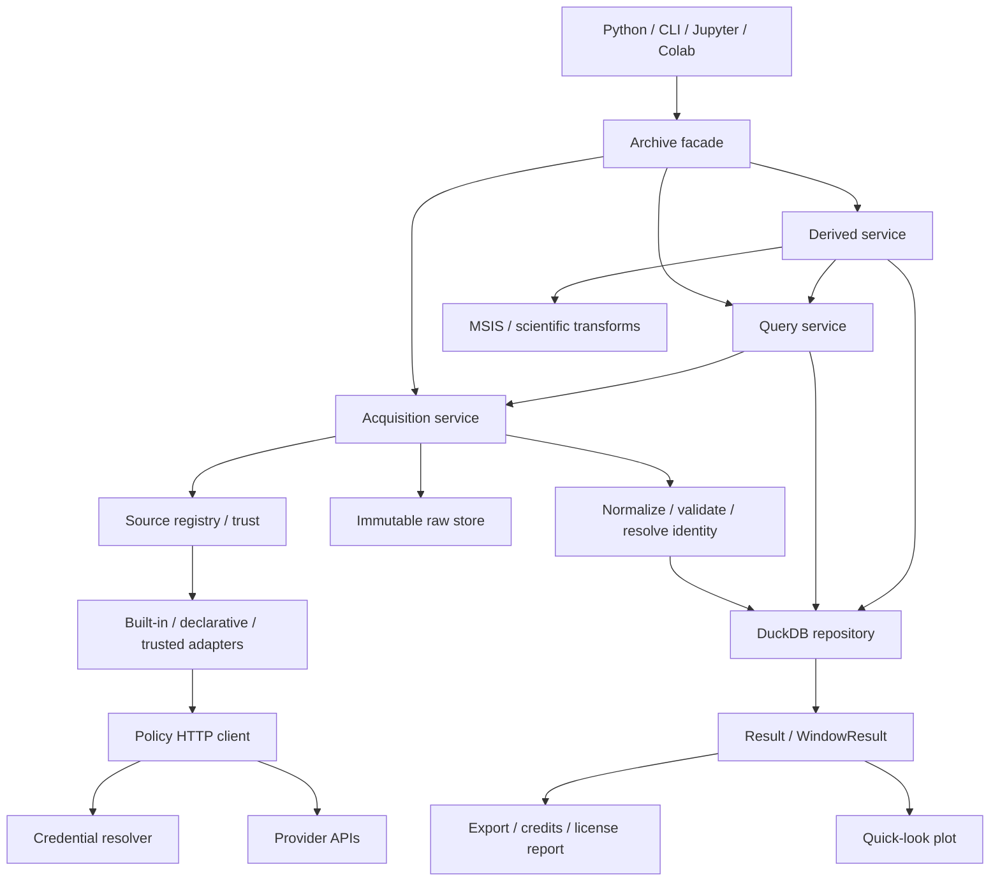
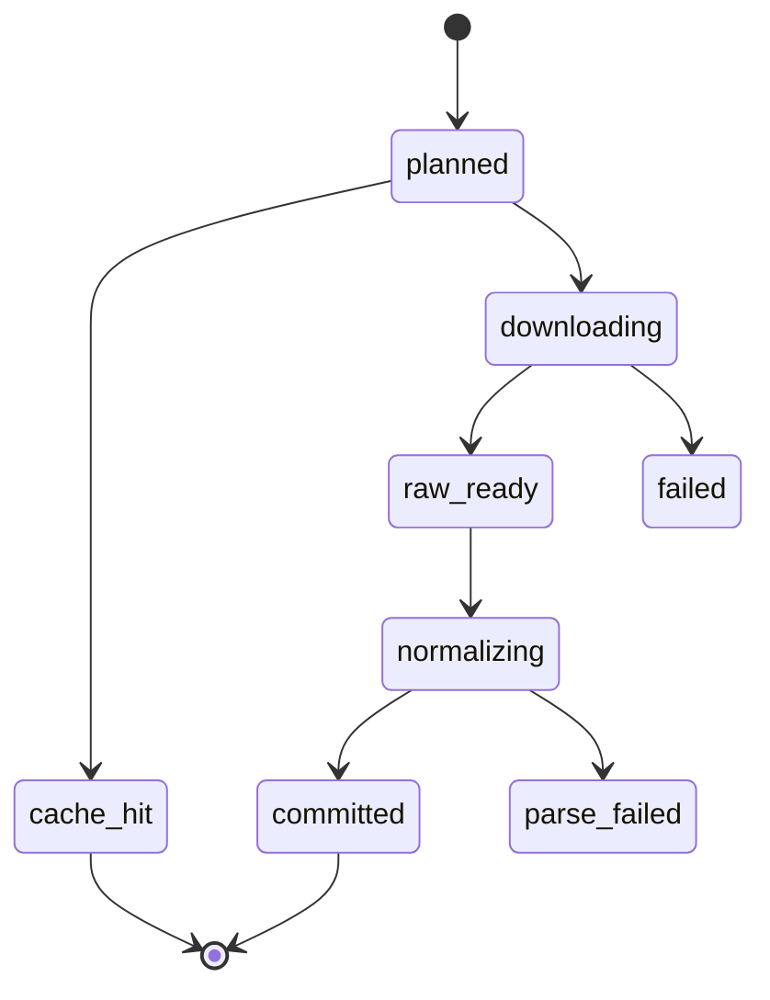

# Orbitoby v0.1.0 상세 아키텍처 / Detailed Architecture

작성일: 2026-09-28 · 설계 버전: 0.3 · 상태: Master Plan v2.0 대조 및 착수 전 빈틈 검토 완료; 세부 ADR·구현 검증 진행 전

이 문서는 사용자가 제공한 **Orbitoby Ultimate Master Plan v2.0**을 상세 실행 구조로 풀어 쓴다. 2026-09-28 원본 전체 0~55절을 대조했으며, 저장소의 `ORBITOBY_MASTER_PLAN.md`는 제공 파일의 byte-identical snapshot이다. 원본 위치·해시·절별 매핑과 변경 내용은 `ORBITOBY_MASTER_PLAN_RECONCILIATION.md`를 따른다.

우선순위는 사용자 명시적 결정 → Master Plan v2.0 → 상세 설계/체크리스트 → 미승인 ADR 후보다. v2.0에 명시된 결정은 이전 설계 제안으로 덮어쓰지 않는다. 원본 안의 설명·예시·장기 일정은 설계 자료이며 즉시 코드 실행·외부 게시·연구 수행을 지시하는 명령으로 취급하지 않는다. 사용자가 직접 개발하는 작업 방식을 유지한다.

## 1. 설계 목표와 경계 / Goals & boundaries

Orbitoby는 우주물체와 우주환경 데이터를 수집·보존·통합하고, 연구에 필요한 기본 파생량과 출처를 함께 제공하는 로컬 Python 패키지다. SourceAdapter의 단순 묶음을 넘어 동일 물체·변수·연구 기간을 분야 중심으로 조회한다.

필수 영역: 기존 9개 및 admission을 통과한 연구 우선 built-in source, raw archive/coverage/cache, source licensing/policy, credentials, JSON/CSV/TSV 선언형 사용자 source와 신뢰 기반 Python plugin, canonical warehouse, identity, derive를 포함한 8개 핵심 API, MSIS/고도/감쇠/항력 파생량, plot/export, CLI/Jupyter/Colab, PyPI 및 Zenodo DOI.

핵심 불변조건:

1. 저장한 raw bytes를 수정하지 않는다. 제공자 갱신은 새 artifact다.
2. source가 실제 제공한 값, 정규화한 값, 모델·계산 결과를 구별한다.
3. 결과 행에서 입력 자료·변환·license까지 추적할 수 있다.
4. 다운로드 성공과 정규화 성공, 조회 가능한 coverage를 구별한다.
5. 날짜·단위·식별자 충돌을 조용히 추정해서 채우지 않는다.
6. plugin 발견과 Python 실행을 구별한다. 신뢰하지 않은 plugin은 import하지 않는다.
7. 공개 source를 쓰기 위해 계정·keyring·network access를 import 시점에 요구하지 않는다.
8. 기존 사용자 raw/DB/credential을 보존하며 migration한다.
9. 범위와 품질은 고정하고 일정은 실측 후 조정한다.

비목표: 분산 서버·S3, 자체 full OD/GNC/전파 엔진, GUI, 완전한 Python sandbox, admission을 통과하지 못한 소스의 지원 완료 주장, 논문 통계 분석의 자동 결정.

## 2. 전체 구조 / System map



의존 방향: interface → application → domain/ports. storage/HTTP/adapters/models는 그 계약을 구현한다. SourceAdapter는 Archive, plotting, CLI를 import하지 않는다. warehouse는 source별 HTTP를 알지 못한다. plot/export는 수집을 수행하지 않는다. 각 모듈이 따로 설정·로그·credential을 생성하지 않고 Archive가 구성한 실행 context를 전달한다.

v0.1.0은 단일 프로세스 동기 흐름을 기본으로 한다. 불필요한 메시지 버스, 서비스 서버, 추상 backend 계층을 만들지 않는다. adapter 테스트가 가능하도록 HTTP와 저장 경계에만 교체 가능한 계약을 둔다.

## 3. 권장 폴더 구조 / Target layout

아래는 목표 책임 배치다. 빈 파일을 모두 미리 생성하지 않고 해당 기능을 구현할 때 나눈다. 기존 파일은 회귀 테스트를 먼저 만든 뒤 단계적으로 이동한다.

```text
orbitoby/
  pyproject.toml
  uv.lock
  README.md
  LICENSE
  NOTICE
  SECURITY.md
  SOURCES.md
  CONTRIBUTING.md
  CITATION.cff
  CHANGELOG.md
  AI_USAGE.md                        # AI 기여·검증·실제 사람 검토 상태
  .env.example
  .gitignore
  .github/workflows/{ci,source-health,release}.yml
  docs/
    ORBITOBY_MASTER_PLAN.md           # 제공된 Ultimate Master Plan v2.0 snapshot
    ORBITOBY_V0.1.0_CHECKLIST.md       # 진행 상태 운영본
    ORBITOBY_ARCHITECTURE_V0.1.0.md    # 이 문서
    audit/                           # 감사/검증 증거
    adr/                             # 세부 결정 이유
    sources/                         # 데이터셋별 source 설명
  examples/
    quickstart.py
    science_day.py
    user_source.py
    notebooks/                       # 비밀과 제한 데이터 출력 제거
  src/orbitoby/
    __init__.py                      # public exports만
    service.py                       # Archive facade; 호환 진입점 유지
    config.py                        # Settings, 경로, 명시적 환경 로딩
    errors.py                        # 공통 typed exceptions
    cli.py                           # 얇은 command interface
    domain/
      requests.py                    # QuerySpec, FetchSpec, policy enums
      records.py                     # canonical row/field 계약
      metadata.py                    # SourceMetadata, SourcePolicy
      results.py                     # Result, WindowResult, reports
    application/
      acquisition.py                 # 계획→fetch→normalize→commit
      query.py                       # object/orbit/weather/window/search
      timeseries.py                  # alignment/aggregation
      derive.py                      # transform 실행과 lineage
    sources/
      base.py                        # SourceAdapter protocol
      registry.py                    # built-in/user/plugin 이름·capability
      declarative.py                 # low-code JSON/CSV/TSV mapping
      plugins.py                     # metadata discovery/trust/load
      spacetrack.py
      celestrak.py
      noaa.py
      gcat.py
      satnogs.py
      launchlibrary.py
      spdf.py
      gfz.py
      f107_canada.py
    transport/
      http.py                        # policy enforcement/session/retry
      redact.py                      # 공통 비밀값 제거
    auth/
      credentials.py                 # runtime/env/keyring/Colab resolver
    archive/
      raw.py                         # immutable blobs + safe manifests
      registry.py                    # user declarations & trust metadata
    warehouse/
      db.py                          # connection/transaction lifecycle
      schema.py                      # DDL & schema versions
      migrations.py                  # versioned, reversible recovery flow
      repository.py                  # parameterized domain queries/writes
      coverage.py                    # checked intervals & fetch planning
      identity.py                    # canonical ID mapping/conflicts
    derived/
      orbit.py                       # altitude/decay
      msis.py                        # selected model wrapper
      drag.py                        # named physical definitions
    export.py                        # CSV/Parquet/sidecar/credits
    plotting.py                      # matplotlib quick-look
  tests/
    unit/
    integration/
    acceptance/
    live/                            # explicit opt-in; account required marker
    fixtures/                        # redistribution reviewed
```

`catalogue.py`는 실제 기능을 감사한 뒤 query/identity/repository 중 맞는 위치에 통합한다. 기존 DB의 `object_catalog` 같은 이름은 새 코드 배치와 무관하게 migration으로 다룬다. 모듈 이동만으로 사용자 데이터 파일을 삭제하지 않는다.

## 4. 모듈별 책임과 계약 / Module contracts

| 모듈 | 입력 → 출력 | 책임 | 금지되는 부작용 |
|---|---|---|---|
| config | explicit options/env → Settings | data root·network/cache defaults 검증 | import 시 .env 자동 탐색/DB 생성 |
| service | public calls → Result/WindowResult | 구성·lifecycle·입력 전달 | 수백 줄 source별 분기 |
| metadata | source definitions → validated metadata | capability·policy·license snapshots | unknown license를 open으로 변경 |
| registry | source ID → descriptor/adapter | 이름 충돌·availability·trust | discovery 때 plugin import |
| credentials | profile reference → short-lived secret context | 명시적 우선순위·삭제·마스킹 | manifest/raw/registry에 비밀 저장 |
| HTTP | RequestSpec + SourcePolicy → response stream | TLS·host·redirect·timeout·rate·retry·5xx circuit/backoff·Orbitoby User-Agent | source 정책 우회 |
| acquisition | FetchSpec → AcquisitionReport | coverage 계획·raw·normalize·atomic commit | query 편의를 위한 무단 대량 수집 |
| adapter | dataset request + HTTP → payload; payload → normalized batch | provider 형식 해석·필드 매핑 | DB에 직접 SQL 쓰기 |
| raw | stream + redacted context → ArtifactRef | content hash·immutable write·safe manifest | network 응답 본문에 남은 비밀을 무조건 공개 |
| identity | external identifiers → resolution candidates | 안정 ID·ambiguity·conflict | 이름만으로 자동 병합 |
| repository | typed filters/batches → rows/commit report | query·transaction·provenance 관계 | 외부 endpoint 호출 |
| coverage | requested range + cache records → FetchPlan | gap 계산·TTL·negative cache | 오류를 success-empty로 취급 |
| query | QuerySpec → Result/WindowResult | 분야 조회·source selection·missing report | 보간을 데이터 원본처럼 반환 |
| timeseries | result fields + alignment → time series result | resample·tolerance·quality propagation | 미래 표본의 묵시적 결합 |
| derive | transform spec + input results → DerivedResult | 입력 확인·수치 계산·lineage | 미상 mass/Cd를 고정값으로 은폐 |
| results | data + metadata + provenance | selection·reports·export·plot bridge | .plot/.to_pandas에서 fetch |
| export | Result + destination → ExportReport | atomic files·sidecars·rights report | 모든 외부 데이터 Apache로 재라이선스 |
| plotting | numeric Result → Figure/Axes | time x축·단위별 panel·gap | custom plotting framework 확장 |
| CLI | args → API calls/output/exit code | 계정 안내·영한 help | API와 다른 storage 정책 |

단순 list/dict를 경계 없이 넘기지 않도록 FetchSpec/ArtifactRef/NormalizedBatch/AcquisitionReport 등의 최소 typed 계약을 둔다. 내부 모든 행을 반드시 거대한 클래스 계층으로 만들 필요는 없다.

## 5. 실행 구성 / Runtime composition

`Archive(settings=None, data_dir=None, credentials=None)`는 명시적 인자가 환경보다 우선한다. 생성자는 설정/객체를 구성하며 plugin 실행이나 네트워크를 시작하지 않는다. DB는 첫 사용 또는 context 진입 시 열고 close/context exit에서 닫는다. lazy initialization 실패는 해당 operation의 오류로 반환한다.

Settings에는 data root, offline/network policy, default source selection, cache TTL override 허용 범위, logging level을 둔다. secret 값은 Settings repr/serialization에 포함하지 않는다.

credential 우선순위는 원본 §6에 따라 **explicit runtime → OS keyring → environment variables → Colab Secrets → .env development compatibility**로 고정한다. keyring backend가 사용 불가하면 진단 후 다음 provider로 진행하되, 자격증명이 존재하지만 서버 인증이 거절된 경우 다른 계정으로 조용히 바꿔 재시도하지 않는다. 다중 provider 충돌·backend 오류 처리는 AUTH-01에서 검증한다. `.env`는 개발자 편의를 위한 명시적 로딩 경로만 지원하며 설치된 package가 저장소 루트의 `.env`를 찾는 구조는 제거한다.

SourceDescriptor에는 `kind=builtin|declarative|python`, install/import 경로, package/version, capabilities, trust status를 담는다. secret은 profile key로만 참조한다. 권한 없는 사용자가 plugin config만 바꿔 신뢰된 이름을 가로채지 않도록 distribution identity/version을 trust record와 대조한다. 이것이 임의 Python 코드에 대한 sandbox를 제공하는 것은 아니다.

## 6. public API 및 결과 계약 / Public API

아래 signature는 목표 계약이다. 기존 API와 차이는 호환 wrapper 또는 명시적 migration note로 해결한다.

```python
with Archive(data_dir=...) as archive:
    archive.sources_available()
    archive.fetch(source, dataset, *, start=None, end=None, **params)
    archive.object(*, norad_id=None, cospar_id=None, provider_id=None)
    archive.orbit(*, norad_id=None, cospar_id=None, start, end, sources=None)
    archive.space_weather(*, start, end, fields, sources=None)
    archive.window(*, norad_id=None, cospar_id=None, start, end, include)
    archive.timeseries(*, start, end, fields, norad_id=None, cadence=None)
    archive.search(*, category="object", filters=None, limit=100)
    archive.derive(transform, *, inputs, **parameters)
```

공통 query 옵션은 `network=missing|never|refresh`, source 선택, 엄격/부분 결과 정책이다. 실제 전달 방식은 request 객체와 kwargs 중 public 일관성을 고려해 결정한다. 기본 `network=missing`은 capability에 맞는 필요한 범위만 수집한다. `never`는 로컬 조회만 한다. source를 명시하면 자동으로 다른 source로 대체하지 않는다. 자동 선택 시 선택 근거·누락 source를 metadata에 기록한다.

모든 날짜 범위는 내부 UTC `[start, end)`를 제안한다. 날짜 문자열은 UTC 00:00으로 해석하고 timezone 없는 datetime 처리 정책은 문서화한다. provider가 inclusive end를 요구하면 adapter가 변환하고 반환 자료를 내부 범위로 다시 필터링한다. 기존 API가 inclusive였다면 조용히 바꾸지 않는다.

`Result`의 최소 계약:

- `data`: canonical tabular data. 직접 변경과 view/copy 정책을 문서화한다.
- `meta`: fields/units/time basis/quality/coverage/source selection/query spec.
- `provenance`: record/artifact/transform/license references.
- `sources`: 실제 결과 행에 기여한 source/dataset의 집합과 관련 metadata. 등록만 된 source는 제외한다.
- `warnings`: structured codes, safe messages; error를 warning으로 무조건 낮추지 않는다.
- `credits()`, `license_report()`, `to_pandas()`, `to_csv()`, `to_parquet()`, `plot()`.
- field selection은 lineage와 units를 함께 줄인다. slice 후 관계없는 source가 credits에 남지 않도록 한다.

`WindowResult`는 분야별 Result mapping과 전체 coverage report를 가진다. orbit과 space weather를 무조건 거대한 outer join으로 합치지 않는다. 명시적 timeseries 호출이 alignment를 수행한다.

`fetch()`는 `AcquisitionReport`를 반환하는 설계를 제안한다: requested datasets/ranges, cache hits, new artifacts, normalized row counts, coverage committed, warnings/failures. 실제 자료 조회는 query API로 수행한다. 기존 fetch 반환 형식은 감사 후 호환 판단한다.

`search()`는 이름/identifier/type/owner뿐 아니라 원본 §14의 object_type, mass_kg 범위, altitude_km 범위, inclination_deg 범위, launch_year 범위를 지원한다. temporal orbit 필터는 평가 epoch/window와 선택 규칙을 명시하고, 서로 다른 epoch의 고도·경사각을 우연히 조합하지 않는다. DuckDB SQL과 Parquet predicate/projection pushdown으로 필터·집계 후 필요한 결과만 materialize한다. 임의 SQL 문자열을 public filter로 받지 않는다. 정렬/limit으로 결과 크기를 제어하고 시간 필터는 분야별 의미를 명시한다.

## 7. 데이터 모델 / Canonical model

### 공통 저장 원칙

- object identity와 provider record identity를 구별한다.
- row마다 source/dataset/artifact, 원본 record locator, normalized schema/parser version이 추적 가능해야 한다.
- 물리량은 값·단위·품질·원래 변수명을 함께 보존한다. canonical 단위 변환의 factor/version을 기록한다.
- time series는 UTC timestamp와 provider의 시간 기준·cadence를 보존한다. 날짜뿐인 일자료에 가짜 정밀도를 부여하지 않는다.
- 원본 충돌을 지우지 않고 preferred view를 별도로 계산한다.

| 테이블/논리 집합 | 키/주요 필드 | 용도 |
|---|---|---|
| schema_versions | version, applied_at, migration_id | migration 통제 |
| source_snapshots | source_id, metadata_hash, license/policy snapshot | 당시 조건 추적 |
| artifacts | artifact_id, sha256, path, bytes, media_type | 불변 payload |
| fetch_runs | run_id, source/dataset, signature, timestamps, status | 동일 raw 여러 요청 이력 |
| artifact_fetches | run_id, artifact_id, request_page | payload와 요청 M:N |
| coverage | source/dataset/query key, start/end, checked_at, expires_at, state | 요청·데이터 구간 구별 |
| objects | object_id, preferred display name, type | 내부 물체 ID |
| identifiers | namespace, value, object_id, source, validity/confidence | NORAD/COSPAR/provider ID |
| aliases | alias text, object_uid, source, validity, confidence | 이름·별칭 이력; 단독 자동 병합 금지 |
| identity_conflicts | candidate IDs, evidence, resolution state | 충돌 보존 |
| orbit_elements | record_id, object_id, epoch, elements, format | GP/TLE/OMM 계열 자료 |
| physical_properties | object_id, property, value/unit, validity, quality | mass/size/area/shape 등 |
| missions / launches / radio / reentries | domain IDs, object links, domain fields | 분야별 자료 |
| space_weather_series | record_id, variable, time, cadence, value/unit, quality | 지수·우주환경 시계열 |
| space_weather_events | event_id, type, start/peak/end, related IDs, source | CME/flare/storm 등 이벤트, 시계열과 분리 |
| licenses | license_id, source/dataset, terms URL, reviewed_at, snapshot | 데이터 조건·citation의 버전별 기록 |
| provenance | record_id, artifact_id, source locator, parser version | 정규화 계보 |
| transforms | run_id, name/version, model/version, params hash | 계산 실행 기록 |
| transform_inputs | run_id, input record/artifact references | 파생 입력 계보 |
| derived_values | record_id, run_id, object/time, variable, value/unit, flags | 계산 결과 |

Master Plan의 내부 identity 이름은 `object_uid`다. 현재 DB `object_id`는 호환 migration 대상으로 남기고 외부 COSPAR `OBJECT_ID`와 명확히 구별한다. source-native 자료를 보존하는 `source_records`와 canonical row를 별도로 연결한다. 매핑 우선순위는 NORAD → COSPAR → trusted provider cross-ID → documented launch/piece relation → name candidate다. 이는 증거 검토 순서이며 상충 ID를 높은 우선순위 하나로 덮으라는 의미가 아니다. name candidate는 사람/추가 명시 증거 없이 merge하지 않는다.

이 표는 논리 스키마다. 물리 DDL은 현 DB 감사 후 확정한다. mission/launch/object의 다대다 관계는 bridge table로 표현한다. radio ID를 object ID로 오인하지 않는다. field catalog는 variable 이름·단위·cadence·의미를 코드와 문서에서 공유한다.

권장 canonical 단위: altitude km, mass kg, area m², density kg/m³, decay km/day(부호 명시), mean motion rev/day, angles degree. 내부 수식에서 SI로 변환하고 출력 단위를 명시한다. F10.7은 sfu, Kp는 무차원 지수, ap/Ap와 Dst/AE는 공급 문서의 정의·단위를 확인해 각각 유지한다.

weather field 예: `f107_observed`, `f107_adjusted`, `ssn`, `kp`, `ap`, `Ap`는 API에서 대소문자 혼동을 피할 표준 이름(예: `ap_3h`, `ap_daily`)을 field catalog ADR로 확정한다. 서로 다른 의미를 하나의 `ap` 필드로 합치지 않는다.

## 8. 수집 파이프라인 / Acquisition pipeline

1. 요청 검증: source/dataset/capability/identifier/시간/크기 한계를 확인한다.
2. 정책 해석: offline/auth/rate/license 관련 사용 조건과 source snapshot을 정한다.
3. coverage 조회: query signature에 영향을 주는 필터와 dataset revision을 포함한다. secret은 제외한다.
4. FetchPlan 작성: cache hit, TTL 만료, uncovered interval, page/chunk를 나눈다.
5. 실행: adapter가 공통 HTTP로 한 chunk/page를 요청한다. timeout/429/5xx/redirect 정책을 적용한다.
6. raw 임시 파일에 streaming 저장하며 hash 계산. 완료 후 동일 파일시스템에서 atomic rename한다.
7. 비밀 제거 manifest와 fetch_run 연결을 저장한다. 중복 bytes는 재사용하되 acquisition 이력은 새로 남긴다.
8. raw에서 parse→단위/시간 변환→schema validation→identity 후보 해석을 수행한다.
9. DB transaction에서 normalized rows + provenance + 성공 coverage를 함께 commit한다.
10. report에 cache/new/empty/failed 구간을 구별해 반환한다.



parse_failed raw는 진단·재정규화를 위해 보존하지만 정상 query coverage를 채우지 않는다. raw 파일시스템과 DB는 하나의 transaction이 아니므로 crash 복구가 필요하다. manifest/orphan 스캔으로 raw 존재·DB 링크·hash를 비교하고 raw_ready 상태를 재개할 수 있게 한다. 실패 복구가 기존 bytes 삭제를 의미하지 않는다.

SourcePolicy에는 원본 §5의 `cache_ttl`, `historical_immutable`, `revision_window`, `provisional_window`, `refresh_interval`, `max_query_span`을 명시한다. immutable history와 잠정/개정 가능 구간을 달리 계획하고 TTL 하나만으로 모든 재수집을 결정하지 않는다.

coverage의 `checked_empty`는 provider가 정상 응답한 범위에만 허용한다. 단순 row min/max로 요청 전체가 완전하다고 판단하지 않는다. pagination 누락이나 provider truncation이면 partial이다. identity mapping이 뒤늦게 바뀌어도 raw request signature와 coverage 원형은 남긴다.

## 9. 조회·정렬 파이프라인 / Query & alignment

1. QuerySpec 검증과 object resolver 실행.
2. requested fields/categories를 source capability에 매핑.
3. local warehouse에서 coverage·변수 availability 확인.
4. network policy에 따라 필요한 FetchPlan만 수행.
5. source별 canonical rows를 읽고 충돌 선택 규칙을 적용.
6. fields/units/quality/provenance를 묶어 Result 반환.
7. timeseries 요청이면 별도 alignment 수행 후 transform lineage를 부착.

기본은 원래 timestamp 유지와 무보간·무 forward fill·무 resample이다. 원본 §13처럼 변수/분야별 `alignment={...}` 계약을 제공한다. `nearest`는 사용자가 명시한 tolerance/tie/future 허용 여부를 요구하고, `daily_exact`와 `aggregate_max`의 의미·빈 bin·bin 경계를 검증한다. cadence 지정 시 field별 aggregation 허용 여부를 확인한다. 숫자라는 이유로 Kp 같은 지수를 무조건 산술평균하지 않는다. as-of는 방향·tolerance를 명시하고 future lookup을 기본 허용하지 않는다. 정적 physical property는 validity interval로 결합한다.

source 우선순위는 변수별 정책이며 전역 source 순위 하나로 모든 값을 덮지 않는다. 동일 timestamp의 여러 값은 원본에서 공존하고 선택 결과에 선택 이유를 남긴다. 최종 result는 실제 available range, gaps, attempted/failed source를 보고한다.

## 10. 파생량 파이프라인 / Derived pipeline

`TransformSpec = name + version + input field contract + parameters + model/dependency versions + constants`. 실행 provenance에는 입력 source records, Orbitoby software version, creation time도 필수다.

1. 필요한 입력과 단위·cadence·quality 검사.
2. 지원 입력이 없으면 MissingInputError 또는 명시적 partial result.
3. 입력 snapshot과 transform cache key 생성.
4. scientific function 실행. 계산 자체는 HTTP/DB에 접근하지 않는 함수로 만든다.
5. 수치 범위·NaN/inf·단위 검사와 quality flags 생성.
6. output rows + transform/input lineage commit.
7. 모델 산출물임을 표시한 Result 반환.

### 고도와 감쇠

v0.1.0 기본 변환 목록은 altitude, orbital period, semimajor axis, apogee/perigee, point-to-point decay와 rolling decay metrics, MSIS density, 정의된 ballistic/drag parameter transforms다. orbital period·apogee/perigee를 provider 필드 조회만으로 끝내지 않고 지원 입력에서 계산 가능하도록 계약·수치 기준을 마련한다. rolling estimator 비교 분석 자체는 연구 repo가 담당한다.

mean motion으로부터 도출하는 semi-major axis/mean altitude는 선택한 μ와 지구 반경, 평균요소 가정을 기록한다. 타원 궤도의 순간 고도와 구별한다. `dh/dt`는 불규칙 epoch·최소 표본 수·gap threshold·window definition을 받는다. 양수/음수 의미를 API 문서에 고정하고 기동/자료 이상 가능성을 flag로 남긴다.

### MSIS

backend 하나를 선택하고 wrapper만 제공한다. UTC, 위치(위도/경도/고도), observed F10.7와 해당 평균·Ap 이력 등 선택 모델이 요구하는 입력을 정확히 구성한다. satellite epoch 위치가 필요한 경우 검증된 외부 propagation/좌표 변환 라이브러리를 연동한다. 사용자 지정 grid/위치 입력도 허용한다. 고도만으로 전 지구 동일 density를 계산하지 않는다. 모델 버전·입력 지수·위치 생성 방법을 lineage에 넣는다.

### 항력 관련 기본 변수

초기 출력 후보: `area_mass_ratio`, 명확히 정의한 `ballistic_coefficient = mass/(Cd*area)`, `drag_acceleration = 0.5*rho*Cd*area/mass*v_rel²`. 지원할 정확한 목록은 ADR로 고정한다. Cd, 유효 면적, 질량, 상대속도/대기 공회전 가정이 필요하며 미상 값을 숨긴 default로 채우지 않는다. TLE B*와 물리적 BC를 동일시하지 않는다. 과학적 검증 없는 역추정·기동 복원 기능은 추가하지 않는다.

## 11. 소스별 역할 / Source capabilities

| Source | 주요 역할 | 구현 시 확인할 항목 |
|---|---|---|
| Space-Track | historical GP·object identifiers | 인증/session, 시간 범위·pagination, provider 정책 |
| CelesTrak | GP 및 catalog 보완 | 형식/epoch, 갱신주기, 재요청/장애 규칙 |
| NOAA SWPC | 관측·예측 우주기상 | 제품별 unit/time/quality, 장기 coverage 한계 |
| GCAT | object/physical/launch/reentry | 열 정의·단위·식별자·unknown markers |
| SatNOGS | object/radio 및 제공 orbit | endpoint별 schema, TLE 오류 회귀 |
| Launch Library | launch/mission | pagination, provider IDs, object linkage |
| NASA SPDF/OMNI | 장기 solar/geomagnetic series | dataset/variable별 coverage·fill values·cadence |
| GFZ | Kp/ap/Ap | 3h/day 구별·확정/잠정·citation |
| Canada F10.7 | authoritative flux | observed/adjusted·측정시각·단위·자료 개정 |

F10.7, SSN, Kp, ap/Ap, Dst, AE의 필수 공급 경로를 source-variable matrix로 검증한다. NOAA의 특정 endpoint나 OMNI dataset 하나가 모든 기간·변수를 제공한다고 가정하지 않는다. 기존 9개는 필수 기반으로 유지한다. 원본 §22의 “all planned research-priority built-ins that pass source admission”에 따라 DONKI/DISCOS/Kyoto/SILSO도 전체 admission 평가 대상이며, 통과한 항목은 v0.1.0에 포함한다. 단순 일정·편의 때문에 선택적으로 제외하지 않는다. 실제 약관/접근/검증 차단은 증거·영향·해결 조건으로 기록한다. 각 source가 candidate/experimental/stable/restricted/deprecated/removed 중 어떤 상태인지, 제한 상태가 안정성 상태와 어떻게 함께 표현되는지 명시한다.

## 12. 저장소와 사용자 데이터 / Storage layout

```text
<data_root>/
  raw/sha256/ab/<hash>                 # bytes, immutable
  manifests/<artifact-or-fetch-id>.json
  warehouse/archive.duckdb
  config/sources.json                  # 선언형/등록 경로, 비밀 없음
  config/plugin-trust.json             # 신뢰 결정, 비밀 없음
  runs/<run-id>.json                   # redacted execution report
  exports/                            # 사용자 지정 시에만
  backups/                            # migration 전 명시적 snapshot
  tmp/                                # incomplete download
```

기존 raw path가 다르면 즉시 전체 이동하지 않는다. DB의 artifact location resolver로 구 경로를 읽고 새 쓰기부터 목표 layout을 적용하는 방식을 우선 검토한다. SHA-256은 bytes 식별자이며 source/license의 단일 식별자가 아니다. 같은 bytes라도 여러 source provenance가 존재할 수 있다.

Google Drive에서 DuckDB 동시 쓰기를 보장한다고 가정하지 않는다. Colab은 local working DB와 명시적 checkpoint/동기화 설계를 우선 검증한다. secrets는 Drive config/노트북 출력으로 복사하지 않는다.

## 13. 실패·보안·권리 / Failure, security & rights

예외 종류: InvalidRequest, UnknownSource, UntrustedPlugin, AuthenticationRequired, AuthenticationFailed, RateLimited, TransportFailure, ParseFailure, SchemaMismatch, IdentityAmbiguous, CoverageMissing, MissingInput, LicenseRestriction, MigrationFailure. 예외 메시지는 안전하게 만들고 내부 response/body를 자동 노출하지 않는다.

partial result는 요청자가 허용한 경우에만 반환한다. 어떤 source/기간/필드가 빠졌는지 structured report가 필수다. 정상 빈 결과와 실패한 요청은 서로 다른 상태다.

built-in 및 선언형 HTTP는 host/redirect/address/timeout/size 정책을 적용한다. trusted Python plugin은 이를 우회할 수 있으므로 실행권한 경계를 문서화한다. parser는 데이터 내용으로 Python 코드를 실행하지 않는다. archive path는 dataset/filename 입력의 traversal을 허용하지 않는다.

license_report는 코드 license와 data license를 분리한다. 사용된 source/dataset policy snapshot, attribution/citation, unknown/restricted condition을 표시한다. 공개 export와 로컬 연구 사용의 차이를 명시하고 조건이 불분명하면 재배포 허용으로 추정하지 않는다. 실제 license 판단은 source 공식 문서 확인 후 기록한다.

## 14. plot·export 설계 / Plot & export

`.plot()`은 네트워크 없이 numeric Result를 그린다. x=time, 한 변수=line, 같은 단위=한 panel, 다른 단위=분리 panel. gap은 선으로 메우지 않는다. unit 미상은 별도 panel/명시적 표시로 처리한다. title/fields 정도만 기본 옵션으로 두고 Figure/Axes를 반환해 고급 제어는 사용자가 직접 한다.

matplotlib 기본 dependency를 제안한다(첫 설치에서 quick-look 가능). 다만 아직 확정하지 않은 ADR 후보이며 MSIS dependency와 함께 배포 크기·지원 환경을 확인한다.

CSV/Parquet는 임시 파일 후 atomic publish하고 sidecar에 query/units/quality/provenance/credits/license를 담는다. 데이터를 제외한 metadata만 복사해도 전체 raw archive가 공개되지 않게 한다. export 완료 후 row count·schema·hash를 ExportReport로 반환한다.

## 15. 테스트 설계 / Verification

| 계층 | 대표 검증 | 외부 네트워크 |
|---|---|---|
| pure domain | 시간/단위/식별자/typed contract | 없음 |
| adapter fixture | 정상·빈·sentinel·개정·형식 오류 | 없음 |
| HTTP mock | 429/redirect/timeout/크기/credential redaction | 로컬 mock만 |
| storage | raw hash·중단 복구·transaction·migration | 없음 |
| application | fetch-plan/cache/query/lineage/plugin | 없음 |
| scientific | 알려진 합성 궤도·MSIS 기준값·단위 | 없음 |
| live source | source별 작은 요청·cache hit | 명시 opt-in |
| acceptance | 새 환경부터 export/재시작까지 | 공개/사용자 계정 구분 |
| release | wheel/sdist/clean install/PyPI/DOI | 게시 단계만 |

회귀는 현재 성공한 NORAD 228 구간 fixture를 우선 확보한다. 실제 live 자료가 개정될 수 있으므로 고정 row count를 모든 미래 live test의 정답으로 사용하지 않는다. 기본 테스트는 개발자의 `.env`와 `.orbitoby`에 접근하지 않는다.

## 16. 단계적 이행 / Migration plan

1. 현재 HEAD·변경·파일·DB/raw 상태를 읽기 전용으로 기록한다.
2. 기존 주요 경로에 characterization tests를 만든다. 이 단계의 구현은 사용자 작업 계획에 따라 수행한다.
3. SourceMetadata/SourcePolicy/HTTP/credentials를 도입하고 기존 adapter를 하나씩 전환한다.
4. `service.py` 외부 API를 유지하면서 acquisition/query를 분리한다.
5. 현 schema와 target schema의 실제 차이를 비교해 migration·복구 테스트를 만든다.
6. identity/catalogue 중복을 합치고 fields/capabilities를 추가한다.
7. 기본 9개 중 미구현 3개와 연구 우선 추가 4개 전체의 평가·통과 소스 구현을 추적하고, API·derived/result/plot/export를 의존 순서대로 구현한다.
8. CLI/Jupyter/Colab·문서·CI·E2E를 완성한다.
9. 검증된 기존 wrapper를 정리한다. 회귀 통과 전 핵심 코드를 삭제하지 않는다.
10. PyPI 게시와 동일 릴리스의 Zenodo 버전 DOI까지 체크리스트를 닫는다.

## 17. 설계 결정 등록 / ADR candidates

| ADR | 제안 | 고정 전 필요한 확인 |
|---|---|---|
| 001 | 동기 단일 프로세스 + 얇은 Archive facade | 기존 service 호출·동시접근 요구 |
| 002 | UTC [start,end), provider 경계 변환 | 기존 inclusive API 호환 |
| 003 | raw content identity와 fetch identity 분리 | 기존 manifest/DB schema |
| 004 | 원본 충돌 공존 + object_uid + 식별 증거 우선순위 | 기존 identity/catalogue 호환 migration |
| 005 | 확정: runtime > OS keyring > env > Colab Secrets > .env 개발 호환 | 원본 §6; fallback 오류 처리만 세부 결정 |
| 006 | metadata discovery 후 trust된 Python만 load | 기존 registry import 동작 |
| 007 | query network policy와 coverage state 분리 | 기존 orbit cache semantics |
| 008 | 최소 Result/WindowResult + sidecar export | 기존 DataFrame 반환 호환 |
| 009 | MSIS backend·위치 input·기본 drag 출력 목록 | 라이선스·설치·기준 수치 검증 |
| 010 | matplotlib core, scientific libs 필요 최소화 | 패키징/지원 OS 검증 |
| 011 | Drive local DB + checkpoint sync | Colab 운영 검증 |

## 18. 체크리스트 연결 / Traceability

| 설계 영역 | 체크리스트 ID |
|---|---|
| 원본/감사/이행 | AUD, GOV |
| source 계약·HTTP·계정 | META, HTTP, AUTH |
| 확장·trust | EXT |
| raw·coverage·canonical·identity | ARC, DB, ID |
| source/variable 공급 | ADM, SRC |
| API·result·정렬 | API |
| scientific transforms | DER |
| export·plot·사용 환경 | OUT, PLOT, UX |
| 문서·검증·게시·DOI | DOC, QA, E2E, REL, DOI, DONE |

다음 단계는 기존 코드 감사 보고서의 파일별 판단과 이 설계를 대조하는 것이다. 계획 문서만을 근거로 현재 코드가 불필요하다고 판단하지 않는다.

## 19. 현재 코드 감사에 따른 보완 / Audit amendments

2026-09-28 실측: object/search/records/reindex와 IdentityStore는 이미 존재한다. 유지할 public compatibility surface에 `records()`, `reindex()`, `artifacts()`, `coverage()`, `get_source()`도 포함해 검토한다. 기존 `fetch()`는 keyword-only source/dataset과 DataFrame 반환이며 `orbit()`은 inclusive 날짜·`source` 단수·`sync` 옵션을 쓴다. 6절 signature는 목표안이므로 그대로 덮어쓰지 않는다.

실제 DB의 12개 artifact path는 옛 `.space-object-archive` root를 가리키며 새 `.orbitoby` root에서 12개 모두 해시가 일치한다. 가장 먼저 복제 DB에서 path repair → reindex → object/search backfill을 검증한다. 해당 수리는 데이터 이동·재수집과 구별한다.

Launch Library의 현재 payload는 여러 page를 재직렬화한 값이다. 신규 adapter 계약은 각 page의 원본 bytes와 fetch context를 따로 내보내야 한다. 기존 합성 artifact는 그대로 유지하고 legacy encoding임을 metadata로 표시한다.

현재 core는 15개 격리 감사 검증을 통과했지만 source live admission, scientific validation, 정식 tests/CI는 미완료다. 상세 증거와 파일별 판단은 `ORBITOBY_CURRENT_STATE_AND_CLEANUP.md`를 따른다.


운영본 위치: 실제 Orbitoby 저장소 `docs/`. 이전 사이언스데이 workspace의 파일은 작성 시점 스냅샷이다.

## 20. v2.0 대조 보완 / Master-plan alignment

### 품질·운영 계약

Source 상태 여섯 종류를 메타데이터·CLI·문서에 일관되게 노출한다. stable 승격은 전체 admission 증거가 필요하며 deprecated/removed의 안내와 기존 raw 읽기 지원을 구별한다. .env는 최하위 개발 호환이며 archive/repo credential 저장 수단이 아니다.

정적 품질은 Ruff + type checking + CodeQL 또는 명시적 동등 static security analysis + dependency audit + secret scan을 포함한다. PR에서는 fixture/mock/contract tests, 주간 실행에서는 rate policy를 지키는 최소 live smoke를 설계한다. 이번 문서 수정으로 실제 예약 작업·workflow를 활성화하지 않는다.

문서는 Getting Started/Installation/Auth/Sources/Data Model/API/Plugins/User Sources/Security/Licensing/Citation/Colab/Research Examples/Troubleshooting/Contributing/Governance/Changelog를 영한으로 추적한다. 문서 사이트는 장기 권장 사항이며 지금 별도 website 구현을 요구하지 않는다.

`AI_USAGE.md`는 실제 도구·모델(알려진 경우)·날짜·기여 범위·수행 검증·사람 검토 여부·최종 결정자를 기록한다. 작성자가 AI인 검증 보고서와 사람의 실제 review를 구별하며 미확인을 완료로 표시하지 않는다. JOSS 등 외부 정책은 제출 시 공식 문서로 재확인한다.

### 소프트웨어와 연구 경계

Orbitoby repo는 library/CLI/source/derived와 범용 예제를 소유한다. `2026-scienceday` 연구 repo는 물체 선정·QC 기준·통계·holdout·논문 figures/tables·manuscript·reproduction package를 소유한다. 패키지의 Result/provenance/export는 이 연구 패키지 생성에 필요한 version/commit/DOI/dataset/model/retrieval metadata를 제공한다.

Master Plan Gate A~E는 프로젝트 전체 완료 개념이며 v0.1.0의 G0~G4와 동일하지 않다. v0.1.0은 §22의 주요 기능 end-to-end + GitHub Release + PyPI + public version DOI로 완료한다. v1.0 API 안정성, 외부 사용자 증거, 논문/소프트웨어 논문 제출은 이후 별도 gate다. 계획의 달력은 목표일이며 실제 repo 공개일·진척으로 재산정한다.

### 저장·상호운용 확장점

raw blob/path와 repository 경계를 좁게 유지해 local filesystem/DuckDB/Parquet를 구현하고 Drive 운영을 검증한다. fsspec/S3는 이후 연결 가능한 인터페이스 경계만 유지하며 빈 backend나 불필요한 dependency를 생성하지 않는다. basic propagation validation helper는 필요한 검증된 라이브러리와 연동한다. full OD/high-fidelity propagation/covariance/maneuver/GNC는 전문 도구와의 interoperability 영역이다.


## 21. 착수 전 보완 / Design revision 0.3

[출시 준비 재점검](ORBITOBY_V0.1.0_READINESS_REVIEW.md)의 R01~R09를 구현 전 검토할 구체 설계안으로 연결한다. 특히 normalization_run과 active parser 결과 전환, legacy orbit COSPAR/internal UUID 분리, 기존 API 반환/시간 경계 호환, 페이지 완전성·수집 상태, source dataset matrix를 먼저 확정한다. 이 제안은 사람의 ADR 승인 완료나 구현 완료를 의미하지 않는다.

현 reindex는 artifact_id+row_index가 이미 있으면 건너뛰는 backfill이다. 새 parser로 재실행해도 기존 값은 바뀌지 않으며 보고서는 indexed를 반환한다. 단순 재실행의 idempotency와 parser version migration을 구별해야 한다. generic fetch(gp_history)는 source_records를 채우지만 orbit_elements/coverage를 채우지 않는다. 두 차이는 현재 소스의 합성 검증으로 확인했고 기존 동작을 조용히 바꾸지 않도록 compatibility/migration 검증에 포함한다.

R07의 MSIS backend/허용오차, 지원 Python·OS와 plot dependency는 공식 근거·실행 검증 전까지 미결정이다. R09의 출시 장애 대응은 공개 tag/자료 불변 원칙을 유지한다. 초기 데이터 복구에서는 schema 개편이나 raw 물리 이동을 함께 수행하지 않는다.
